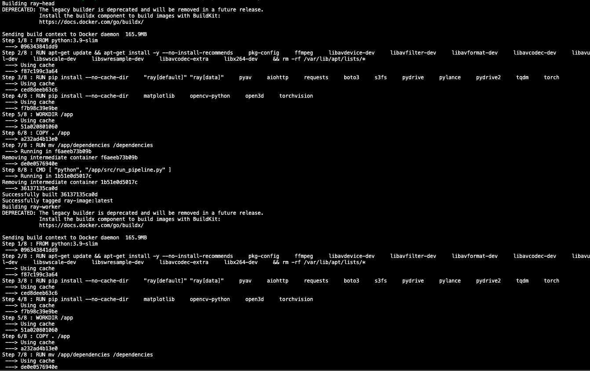
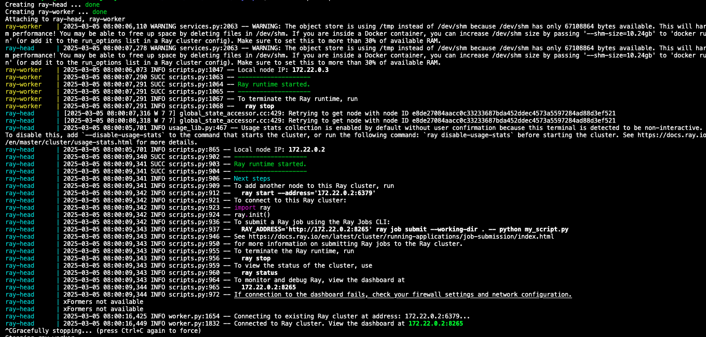

# **rayDepth**
### A Fast, Distributed Video Processing Pipeline for obtaining Depth Maps

## **What is rayDepth?**
rayDepth is a highly parallel video processing pipeline built to handle large-scale depth map extraction from videos. It uses [Ray](https://github.com/ray-project/ray) to distribute tasks across multiple workers, making it fast and scalable. If you’re working with depth estimation and need to process a lot of video data, this pipeline just gets the job done.

Here's what it does:
- Downloads videos from the [Kinetics dataset](https://github.com/cvdfoundation/kinetics-dataset).
- Transcodes them to 360p using `pyav`, storing metadata in [LanceDB](https://github.com/lancedb/lancedb).
- Extracts depth maps using a monocular depth estimation model. Here we use [Depth Anything V2](https://github.com/DepthAnything/Depth-Anything-V2).
- Runs everything in parallel using Ray, so you’re not stuck waiting on slow processing.

## **Why use rayDepth?**  
- Built for scale – Runs across multiple CPU cores without slowing down.
- Fast downloads & processing – Uses async requests with `aiohttp`, so you're not waiting forever.
- Smaller, smarter videos – Transcodes to 360p to save space and speed up depth estimation.
- Better depth maps – Uses a **state-of-the-art model** for high-quality depth extraction.
- Quick lookups – Stores everything in **LanceDB**, so you can access data fast.
- No storage headaches – Uploads processed results directly to **Google Drive** for easy access. We used GDrive here as a [tapullo](https://instantlyitaly.com/words-you-can-hear-only-in-liguria/). When in production you'd ideally want to use S3.

## **How Depth Maps Can Be Used**
Depth maps give video a sense of **real space** by adding depth and perspective. They help AI-generated videos look more natural by making sure **lighting, shadows, and movement** feel right. They also allow for **smooth camera effects** like zooms and focus shifts, making videos more cinematic. In gaming and AR/VR, depth maps help create **realistic environments** that respond to how you move. And when mixing AI-generated content with real footage, they make sure everything **blends** well, so nothing looks out of place.

## How it works
- Fetches `.tar.gz` URLs containing `.mp4` videos.
- Downloads videos asynchronously.
- Extracts `.mp4` files from the archive.
- Converts each `.mp4` to **360p** using `pyav`.
- Stores transcoded files locally before uploading them to Google Drive.
- Uses Depth Anything V2 to estimate depth per frame.
- Compresses the depth maps and stores them to GDrive
- Stores the reference to depth maps, original video, and transcoded video in a LanceDB dataset - also uploaded to Gdrive.

## Installation & Setup
### Prerequisites
- Docker & Docker Compose
- GDrive credentials need to be stored in keys/service_account.json

### How to get started
```bash
git clone https://github.com/algorithmic-co/rayDepth.git
cd rayDepth
mkdir dependencies
cd dependencies
git clone https://github.com/DepthAnything/Depth-Anything-V2
cd ..
docker-compose up --build
```

## Expected CLI Output After Build
After running `docker-compose up --build`, your terminal output should look similar to this:

**Build Phase:**


**Startup & Execution:**


## Configuration
If you need to tweak things, modify `lib/config.py`. You can change:
- Where the dataset is stored.
- Batch size and processing chunk size.  

## Why Depth Anything V2?
- Zero-shot & lightweight
- Apache 2.0 license** (permissive)
- Handles diverse lighting & scenes well
- Smooth, detailed depth maps** with fewer artifacts

## What could be better? Feel free to contribute
We’re happy with how rayDepth works, but there is room for improvement:  
- Error-handling
- Retry mechanism – To avoid download failures
- Storing depth maps in a LanceDB column
- Multi-resolution processing – Supporting different video resolutions could be useful.
- Cloud-based storage – Right now, we use Google Drive because it’s free and quick for development pruposes - but S3 would be better for large-scale production use cases.

We will most likely cover the first two points soon.

## Want to contribute?
Fork the repo, make a new branch, and submit a pull request. Simple as that.

## Who are we?
We’re Algorithmic - a team of builders obsessed with precision, automation, and solving real business problems through AI and software engineering. With nearly two decades of combined experience, we turn complex data into clear, actionable solutions. Our work spans machine learning, AI-driven automation, web scraping, predictive modeling, and business intelligence. We don’t chase hype; we build what works—delivering high-impact, scalable solutions for clients who value execution over empty promises. Every project is a fresh challenge, and for us, work isn’t work - it’s play.